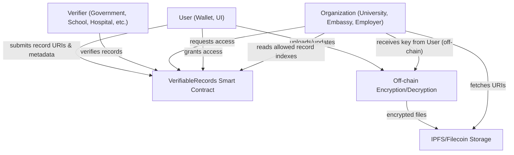

- User interacts with UI, uploads files; files are encrypted and stored in IPFS/Filecoin.
- User submits only URIs/hashes and metadata to the smart contract.
- Verifiers (government, schools, etc.) verify relevant records on-chain.
- Organizations request access; user grants access to specific records.
- Organizations fetch record data from IPFS and request decryption keys off-chain.
